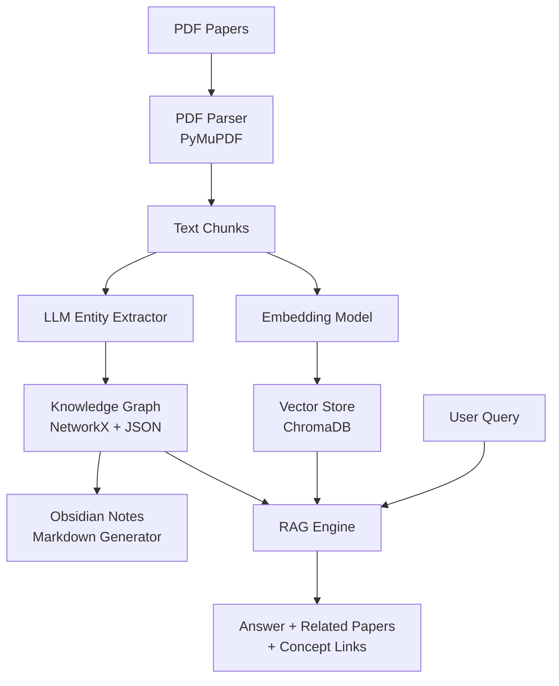

# Knowledge Graph + Obsidian RAG System for Research Papers

논문 PDF를 로컬 지식 그래프와 Obsidian 노트로 변환하고, 개체/관계 추출 기반의 Graph-enhanced RAG를 제공하는 시스템.

## Architecture Overview



## Tech Stack

| Component | Tool | Rationale |
|-----------|------|-----------|
| PDF Parsing | **PyMuPDF (fitz)** | 빠르고 정확한 텍스트/메타데이터 추출 |
| Text Chunking | **LangChain** `RecursiveCharacterTextSplitter` | 의미 단위 청킹 |
| Embedding | **sentence-transformers** (`all-MiniLM-L6-v2`) | 로컬 임베딩, GPU 불필요 |
| Vector Store | **ChromaDB** | 로컬 persistent, 설치 간단 |
| Knowledge Graph | **NetworkX** + JSON persistence | Neo4j 없이 로컬 동작 |
| Entity Extraction | **LLM (OpenAI/Anthropic)** | 바이오메디컬 개체 추출 정확도 |
| Note Generator | Custom Markdown | Obsidian 호환 `[[wikilink]]` 포맷 |
| CLI | **Click** | 간단한 커맨드라인 인터페이스 |

## User Review Required

> [!IMPORTANT]
> **LLM API Key 필요**: 개체/관계 추출 및 RAG 쿼리에 OpenAI 또는 Anthropic API 키가 필요합니다. `.env` 파일에 설정합니다.

> [!WARNING]
> **Neo4j 대신 NetworkX 사용**: 현재 서버에 Docker/Neo4j가 없어 NetworkX + JSON 파일 기반으로 설계합니다. 수천 편 규모까지는 충분하며, 이후 Neo4j로 마이그레이션 가능한 구조입니다.

> [!IMPORTANT]
> **LLM 선택**: 개체 추출에 사용할 LLM을 선택해주세요:
> 1. **OpenAI GPT-4o-mini** (저렴, 빠름) — 기본값
> 2. **Anthropic Claude** (이미 사용 중인 것으로 보임)
> 3. **둘 다 지원** (설정에서 선택)

---

## Proposed Changes

### Project Structure

```
/home/kwy7605/paper_graph_rag/
├── config.py              # 설정 관리
├── .env.template          # API 키 템플릿
├── requirements.txt       # 의존성
├── ingest.py              # PDF 인제스트 파이프라인
├── extract.py             # 바이오메디컬 개체/관계 추출 (LLM)
├── graph.py               # 지식 그래프 (NetworkX)
├── vectorstore.py         # ChromaDB 벡터 스토어
├── notes.py               # Obsidian 마크다운 노트 생성
├── rag.py                 # RAG 쿼리 엔진
├── cli.py                 # CLI 인터페이스
├── data/
│   ├── papers/            # 원본 PDF 보관
│   ├── graph/             # knowledge_graph.json
│   ├── chroma_db/         # ChromaDB 영구 저장소
│   └── vault/             # Obsidian vault (생성된 노트)
│       ├── papers/        # 논문별 노트
│       ├── entities/      # 개체별 노트 (유전자, pathway 등)
│       └── _index.md      # 전체 색인
```

---

### Core Module: PDF Ingestion

#### [NEW] [ingest.py](file:///home/kwy7605/paper_graph_rag/ingest.py)

- PDF에서 메타데이터(제목, 저자, DOI) + 본문 텍스트 추출
- `RecursiveCharacterTextSplitter`로 1000자/200자 오버랩 청킹
- 각 청크에 출처(논문 ID, 페이지) 메타데이터 부착
- 청크를 ChromaDB에 임베딩 저장

### Core Module: Entity/Relationship Extraction

#### [NEW] [extract.py](file:///home/kwy7605/paper_graph_rag/extract.py)

- LLM 프롬프트로 바이오메디컬 개체 추출:
  - **유전자/단백질** (Gene), **세포 유형** (CellType), **질병** (Disease)
  - **Pathway** (SignalingPathway), **실험 조건** (ExperimentalCondition)
  - **약물/화합물** (Drug), **방법론** (Method)
- 관계(Relationship) 추출: `Gene → regulates → Gene`, `Drug → treats → Disease` 등
- 구조화된 JSON 출력 (Pydantic 모델로 검증)

### Core Module: Knowledge Graph

#### [NEW] [graph.py](file:///home/kwy7605/paper_graph_rag/graph.py)

- NetworkX `DiGraph`로 개체(노드) + 관계(엣지) 관리
- 노드 속성: `type`, `aliases`, `papers` (출처 논문 목록)
- 엣지 속성: `relationship_type`, `evidence`, `paper_id`
- JSON 직렬화/역직렬화로 영구 저장
- 그래프 쿼리 함수: 이웃 탐색, 경로 탐색, 서브그래프 추출

### Core Module: Obsidian Notes

#### [NEW] [notes.py](file:///home/kwy7605/paper_graph_rag/notes.py)

- **논문 노트** (`papers/`): YAML frontmatter + 요약 + 추출된 개체 `[[wikilink]]`
- **개체 노트** (`entities/`): 개체 설명 + 관련 논문 역링크 + 관계 목록
- 자동 백링크 업데이트
- Obsidian Graph View에서 시각화 가능한 구조

논문 노트 예시:
```markdown
---
title: "Single-cell RNA-seq reveals..."
authors: ["Kim et al."]
doi: "10.1038/..."
date_added: 2026-02-20
tags: [paper, scRNAseq, B-cell]
---

# Single-cell RNA-seq reveals...

## Summary
LLM 생성 요약...

## Key Entities
- Genes: [[CD19]], [[PAX5]], [[BCL6]]
- Cell Types: [[Germinal Center B cell]], [[Memory B cell]]
- Pathways: [[BCR Signaling Pathway]]
- Diseases: [[Lymphoma]]

## Key Relationships
- [[PAX5]] → regulates → [[CD19]]
- [[BCL6]] → expressed_in → [[Germinal Center B cell]]

## Related Papers
- [[paper_002]] — shares [[BCL6]], [[Germinal Center B cell]]
```

### Core Module: Vector Store

#### [NEW] [vectorstore.py](file:///home/kwy7605/paper_graph_rag/vectorstore.py)

- ChromaDB persistent client
- `sentence-transformers` 임베딩 함수
- 메타데이터 필터링 (논문별, 개체 유형별)

### Core Module: RAG Query Engine

#### [NEW] [rag.py](file:///home/kwy7605/paper_graph_rag/rag.py)

- **Hybrid retrieval**: 
  1. ChromaDB 벡터 검색 → 관련 청크
  2. 청크에서 개체 추출 → Knowledge Graph 탐색 → 관련 개체/논문 확장
  3. 그래프 컨텍스트 + 청크를 LLM에 전달
- 응답에 포함:
  - 답변 텍스트
  - 출처 논문 목록 (제목 + 링크)
  - 관련 개체/개념 (`[[wikilink]]` 형태)
  - "왜 연결되는지" 그래프 경로 설명

### CLI Interface

#### [NEW] [cli.py](file:///home/kwy7605/paper_graph_rag/cli.py)

```bash
# PDF 인제스트 (단일 파일 또는 디렉토리)
python cli.py ingest /path/to/paper.pdf
python cli.py ingest /path/to/papers/ --batch

# RAG 쿼리
python cli.py query "BCL6와 germinal center B cell의 관계는?"

# 그래프 통계
python cli.py stats

# Obsidian 노트 재생성
python cli.py rebuild-notes
```

### Configuration

#### [NEW] [config.py](file:///home/kwy7605/paper_graph_rag/config.py)
#### [NEW] [.env.template](file:///home/kwy7605/paper_graph_rag/.env.template)
#### [NEW] [requirements.txt](file:///home/kwy7605/paper_graph_rag/requirements.txt)

```
pymupdf>=1.25
chromadb>=0.6
sentence-transformers>=3.0
langchain>=0.3
langchain-openai>=0.3
langchain-anthropic>=0.3
networkx>=3.0
click>=8.0
python-dotenv>=1.0
pydantic>=2.0
```

---

## Verification Plan

### Automated Tests

1. **파이프라인 통합 테스트**: 샘플 PDF 1개로 전체 파이프라인 실행
   ```bash
   cd /home/kwy7605/paper_graph_rag
   python cli.py ingest /path/to/sample.pdf
   python cli.py query "이 논문의 주요 발견은?"
   python cli.py stats
   ```

2. **Obsidian 노트 검증**: 생성된 노트 파일 확인
   ```bash
   ls data/vault/papers/
   ls data/vault/entities/
   # 파일 내용에 [[wikilink]] 형태 링크 포함 여부 확인
   grep -r "\[\[" data/vault/papers/ | head -5
   ```

3. **그래프 검증**: 지식 그래프 JSON 확인
   ```bash
   python -c "import json; g = json.load(open('data/graph/knowledge_graph.json')); print(f'Nodes: {len(g[\"nodes\"])}, Edges: {len(g[\"edges\"])}')"
   ```

### Manual Verification

1. **Obsidian에서 열기**: `data/vault/` 폴더를 Obsidian vault로 열어 Graph View에서 연결 관계 시각화 확인
2. **RAG 품질 확인**: 다양한 질문으로 쿼리 후 답변의 출처·관련 개념 링크 적절성 평가
