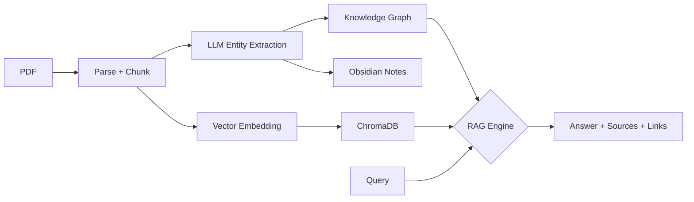

# Walkthrough: Paper Graph RAG System

## What Was Built

논문 PDF를 인제스트하여 **지식 그래프 + Obsidian 노트 + RAG** 시스템을 구축하는 완전한 파이프라인.



## Project Location

📁 `/home/kwy7605/paper_graph_rag/`

## Modules Created

| Module | Lines | Purpose |
|--------|-------|---------|
| [config.py](file:///home/kwy7605/paper_graph_rag/config.py) | 95 | Pydantic 기반 설정 (LLM, 경로, 청킹) |
| [ingest.py](file:///home/kwy7605/paper_graph_rag/ingest.py) | 155 | PyMuPDF PDF 파싱 + RecursiveCharacterTextSplitter 청킹 |
| [extract.py](file:///home/kwy7605/paper_graph_rag/extract.py) | 230 | LLM 바이오메디컬 개체/관계 추출 (OpenAI + Anthropic) |
| [graph.py](file:///home/kwy7605/paper_graph_rag/graph.py) | 260 | NetworkX 지식 그래프 + JSON 영구 저장 |
| [vectorstore.py](file:///home/kwy7605/paper_graph_rag/vectorstore.py) | 115 | ChromaDB 벡터 스토어 (sentence-transformers) |
| [notes.py](file:///home/kwy7605/paper_graph_rag/notes.py) | 235 | Obsidian `[[wikilink]]` 마크다운 노트 생성 |
| [rag.py](file:///home/kwy7605/paper_graph_rag/rag.py) | 210 | 그래프 강화 RAG (Vector + Graph hybrid) |
| [cli.py](file:///home/kwy7605/paper_graph_rag/cli.py) | 220 | Click + Rich CLI (ingest, query, stats 등) |

## Usage

```bash
# 1. API 키 설정
cp .env.template .env && vi .env

# 2. 논문 인제스트
./run.sh ingest /path/to/paper.pdf
./run.sh ingest /path/to/papers/ --batch

# 3. RAG 쿼리
./run.sh query "BCL6와 germinal center B cell의 관계는?"

# 4. 그래프 통계
./run.sh stats

# 5. 개체 검색
./run.sh search-entity "CD19" --depth 2

# 6. Obsidian에서 열기 → data/vault/
```

## What Was Tested

- ✅ All 8 modules import successfully
- ✅ Knowledge graph CRUD (add entity, relationship, save/load JSON)
- ✅ ChromaDB vector store (add, search, cosine similarity)
- ✅ CLI `--help` displays all 5 commands
- ✅ `libstdc++` 호환성 fix (`LD_LIBRARY_PATH` in `run.sh`)

## Next Steps

사용자가 `.env`에 API 키를 설정한 후 논문 PDF를 인제스트하면 시스템이 동작합니다.
